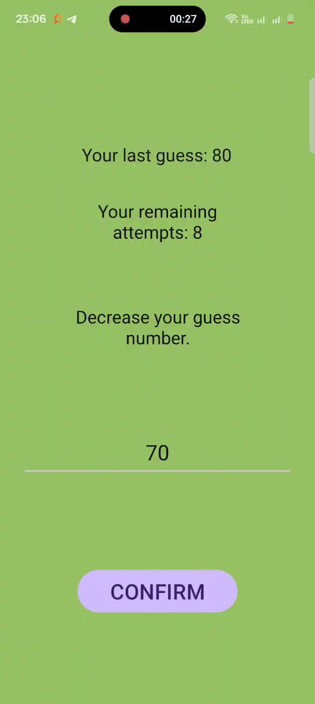

# 🎯 Guess The Number - Android App

A fun and simple Android app where users try to guess a randomly generated number between 1 and 100.

---

## 📱 Features

- 🎲 Random number generation every round
- 📉 Hints after every guess: "Too High", "Too Low", or "Correct"
- 🔄 Restart the game after a correct guess
- 🧠 Clean and beginner-friendly UI
- 🧮 Tracks the number of attempts

---

## 📸 Demo

<p align="center">
  
  
    
</p>

<sub>"The above implementation demonstrates the functioning of the app on my device."</sub>

---

## 🚀 Getting Started

### ✅ Requirements

- Android Studio (latest version recommended)
- Android SDK 21+
- Java or Kotlin

### 🔧 Installation

1. Clone the repository:
   ```bash
   git clone https://github.com/your-username/guess-the-number-app.git
Open the project in Android Studio:

File > Open > Select the cloned folder

Build and run on your emulator or Android device.

🧱 Built With
Java or Kotlin

Android SDK

XML for UI

## 📂 Folder Structure
```
GuessTheNumber/
├── app/
│   ├── manifests/
│   │   └── AndroidManifest.xml
│   ├── java/
│   │   └── com.examplefourthjuly.guessthenumber/
│   │       ├── MainActivity.java
│   │       ├── GameActivity.java
│   │       └── SplashActivity.java
│   ├── res/
│   │   ├── anim/
│   │   │   ├── image_anim.xml
│   │   │   └── text_anim.xml
│   │   ├── drawable/
│   │   │   ├── guess_pic_nobg.png
│   │   │   ├── guess_the_no_icon.png
│   │   │   ├── guessimg.jpeg
│   │   │   ├── rounded_corners.xml
│   │   │   └── rounded_corners_2.xml
│   │   ├── layout/
│   │   │   ├── activity_main.xml
│   │   │   ├── activity_game.xml
│   │   │   └── activity_splash.xml
│   │   ├── mipmap/
│   │   │   ├── ic_launcher/
│   │   │   └── ic_launcher_round/
│   │   ├── values/
│   │   │   ├── colors.xml
│   │   │   ├── refs.xml
│   │   │   ├── strings.xml
│   │   │   └── themes/
│   │   │       ├── themes.xml
│   │   │       └── themes.xml (night)
│   │   └── xml/
│   │       ├── backup_rules.xml
│   │       └── data_extraction_rules.xml
├── build.gradle.kts (Project Level)
├── settings.gradle.kts
├── gradle.properties
├── proguard-rules.pro
├── libs.versions.toml
└── local.properties

```

🧑‍💻 Author
Renu Ekka


